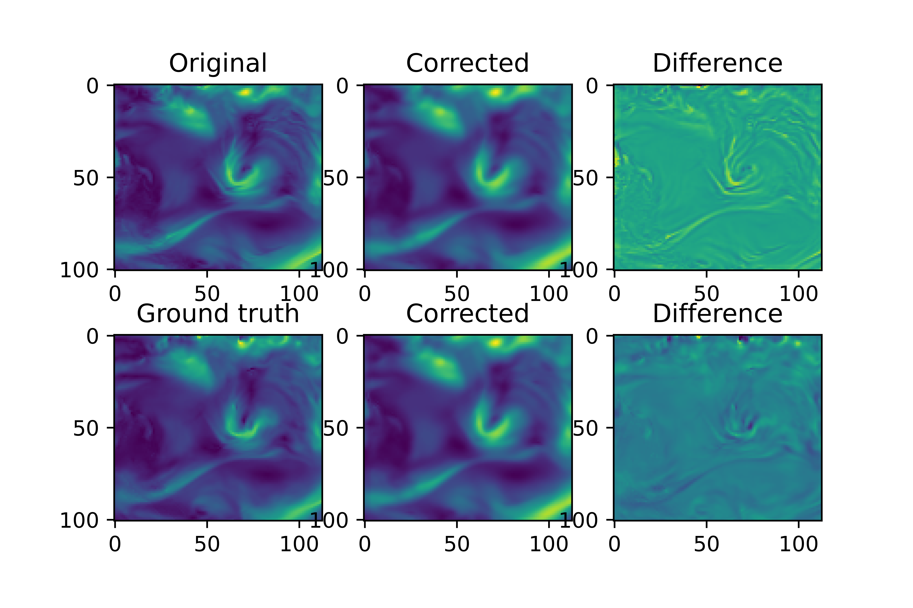

# CNN for postprocessing of IVT images


*Implementation of a Convolutional Neural Network (CNN) for the postprocessing of Integrated water Vapor Transport data.*

## Author
[Bosso Francesco](https://github.com/FBosso) - (fra.bosso97@gmail.com)


## Project Description
Re-implementation of the notebook referred to the 2019 paper by [Chapman et al.](https://agupubs.onlinelibrary.wiley.com/doi/full/10.1029/2019GL083662)

The purpose is to build a ConvNet able to postprocess the IVT (Integrated Vapor Transport)
images derived from NWP models given a set of ground truth IVT values derived from measurement.


## Technologies
+ [tensorflow](https://www.tensorflow.org/): TensorFlow is a free and open-source software library for machine learning and artificial intelligence. It can be used across a range of tasks but has a particular focus on training and inference of deep neural networks.
+ [xarray](https://docs.xarray.dev/en/stable/): xarray (formerly xray) is an open source project and Python package that makes working with labelled multi-dimensional arrays simple, efficient, and fun!.
+ [pandas](https://pandas.pydata.org/): pandas is a fast, powerful, flexible and easy to use open source data analysis and manipulation tool, built on top of the Python programming language.
+ [numpy](https://numpy.org/doc/stable/index.html): NumPy is the fundamental package for scientific computing in Python. It is a Python library that provides a multidimensional array object, various derived objects (such as masked arrays and matrices), and an assortment of routines for fast operations on arrays, including mathematical, logical, shape manipulation, sorting, selecting, I/O, discrete Fourier transforms, basic linear algebra, basic statistical operations, random simulation and much more.
+ [matplotlib](https://matplotlib.org/): Matplotlib is a comprehensive library for creating static, animated, and interactive visualizations in Python. Matplotlib makes easy things easy and hard things possible.

## Output example
Here is displayed a plot showing the results of one IVT corrected sample.

In the first row are showed, from left to right: 
1. the original (forecasted) sample;
2. the postprocessed forecast corrected by the CNN;
3. the difference between the previous 2.

In the second row are showed, from left to right:
1. the ground truth of the original forecasted sample (observation);
2. the postprocessed forecast corrected by the CNN;
3. the difference between the previous 2.



  
## Env Setup

```bash
# create a new environment
$ conda create --name myenv

# activate your new environment
$ conda activate myenv

# install all the dependencies
$ conda install -c conda-forge tensorflow xarray pandas numpy matplotlib

# download the needed data
$ wget https://library.ucsd.edu/dc/object/bb88449405/_2_1.zip/download

# keep only the folders across the path "All_Zarr/GFSIVT_F006_zarr

# place the "All_Zarr" folder outside the one containing the script

# run the script CnnPostprocessing_IVT.py

```
